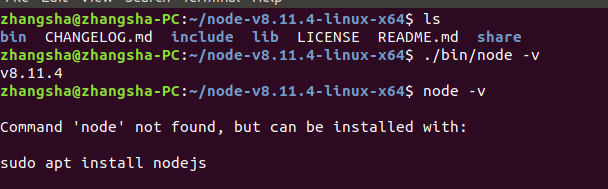
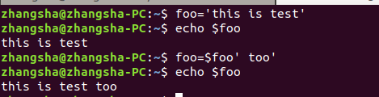
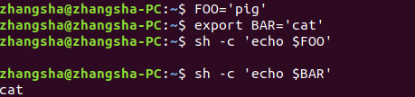

### 环境
#### 背景
安装完node发现在命令行下输入可执行程序node时，提示not found



#### 知识点
- 由于系统的PATH这个环境变量没有存储node所在的目录路径，因此不能正确的找到node程序

> PATH 以冒号分割的一个目录列表，当用户输入一个可执行程序的名称时，会查找该目录列表

因此在shell的启动文件中加入以下代码
```
PATH=$PATH:$HOME/node-v8.11.4-linux-x64/bin
```


- $HOME是参数扩展的方式

 

- 上面重写的PATH并没有export出去，会带来什么问题吗

>对于PATH来说是不会有什么问题的，因为PATH已经是环境变量了，意味着已经被export过了，所以不需要显式的export，shell的子进程也是可以继承的。

>但是如果我们新定义一个变量，没有export，那么shell的子进程是无法读取到该变量的，看下面的示例：
`sh -c`表示在创建的子进程中

