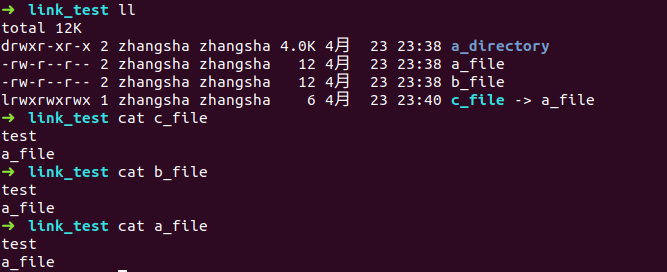
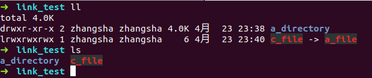

### 链接

#### 硬链接
```
ln file link
```
硬链接的作用允许一个文件可以拥有多个有效路径名，
默认情况下每个文件都有一个硬链接，该硬链接会给文件起名字，当创建一个硬连接时，也为这个文件创建了一个额外的名字。硬链接和文件本身没有什么区别，当硬链接被删除时，并不会影响到这个文件，除非把所有的链接都删除掉，才会让这个文件的存储空间被释放

我的理解：比如在JavaScript中定义一个变量a，a指向（引用）了一个对象{name: 'test'}，接着我们又定义一个变量b，使b = a，这个时候a和b都同时指向（引用）这个对象的内存地址

##### 硬链接的创建有两个限制：
- 硬链接无法引用目录，即：不允许给目录创建硬链接
- 硬链接不能引用不在同一磁盘分区的文件

#### 符号链接（软连接）
```
ln -s item link // item既可是文件，也可是目录
```
符号链接克服了硬链接的局限性，即`不能引用不在同一磁盘分区的文件`，对于符号链接来说可以引用其他分区的文件或目录，也类似于windows的快捷方式。
符号链接是通过创建一个特殊类型的文件来起作用的，该文件包含了指向引用文件或目录的文本指针。

我的理解： 接着上面的列子，创建一个a变量的软连接c，即是让c指向a的内存地址

#### 通过一系列的实验加深理解

下图中我建立一个文件a_file，然后用这个文件分别创建了硬链接b_file和符号链接c_file。
可以看到这三个文件里的内容打印出来都是一样的。
用ll命令看到c_file指向a_file，这与上面js的列子是比较吻合的


总结 
- 删除a_file，对b_file没有影响，会导致c_file失效成为坏链接，用红色来表示
- 删除b_file，对a_file和c_file都没有影响
- 删除c_file，对其他没有影响
- 同时删除a_file和b_file，这个文件会真正的被删除（可以类比为上述例子中：当对象没有任何变量引用时，那么它就会被销毁）




